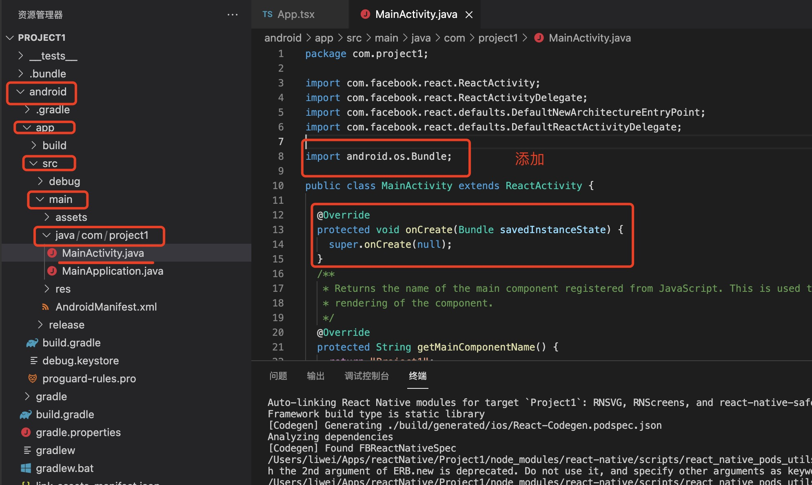

1. 安装react-navigation

          npm install --save react-navigation

          或者

          yarn add react-navigation

     react-navigation 依赖react-native-screens 和 react-native-safe-area-context

          yarn add react-native-screens

          yarn add react-native-safe-area-context
     
     ios 安装

          cd ios && pod install
     
     react-native-screens 在android 端需要配置，在android/app/src/main/java/ProjectName/MainActivity.java 

     引入：

     ```java
          import android.os.Bundle;

          @Override
          protected void onCreate(Bundle savedInstanceState) {
            super.onCreate(null);
          }
     ```
     


2. 要开始使用React Navigation，您必须先创建一个navigator，React Navigation带有三种默认的navigator。

+ StackNavigator - 为应用程序提供了一种页面切换的方法，每次切换时，新的页面会放置在堆栈的顶部

+ TabNavigator - 用于设置具有多个Tab页的页面

+ DrawerNavigator - 用于设置抽屉导航的页面

3. 使用NavigationContainer 包裹整个App

     ```jsx
          import * as React from 'react';
          import { NavigationContainer } from '@react-navigation/native';

          export default function App() {
            return (
              <NavigationContainer>{/* Rest of your app code */}</         NavigationContainer>
            );
          }

     ```

     >注意：在React Native 应用程序中，<span style="color:red">***NavigationContainer应该只在应用程序的根目录中使用一次***</span>。NavigationContainer除非您有特定的用例，否则不应嵌套多个。