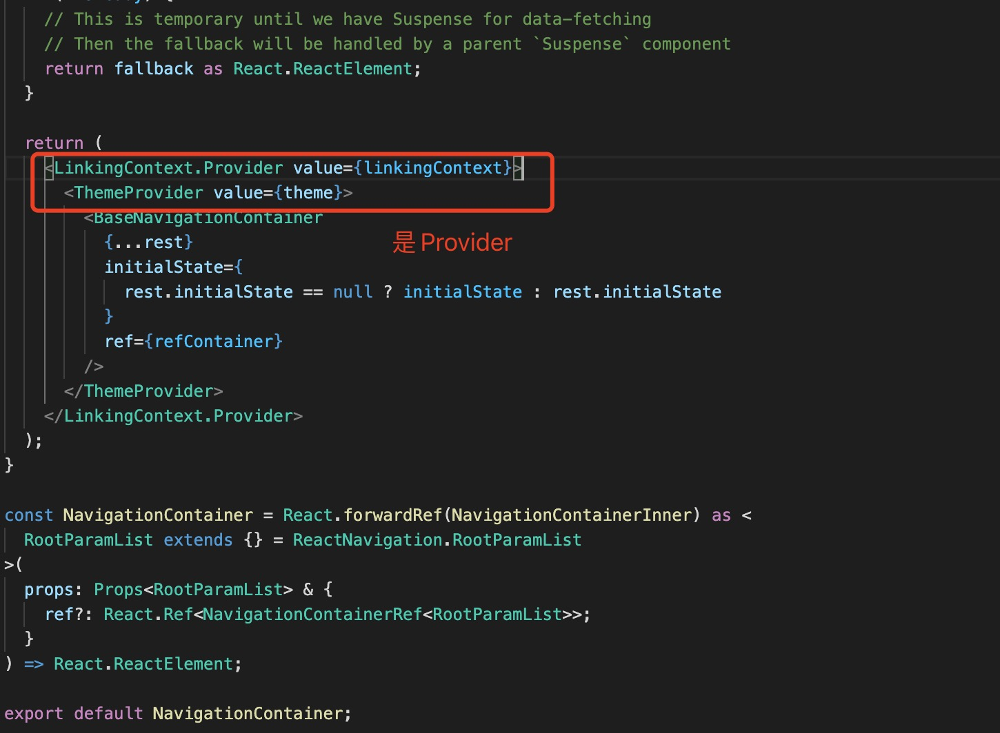
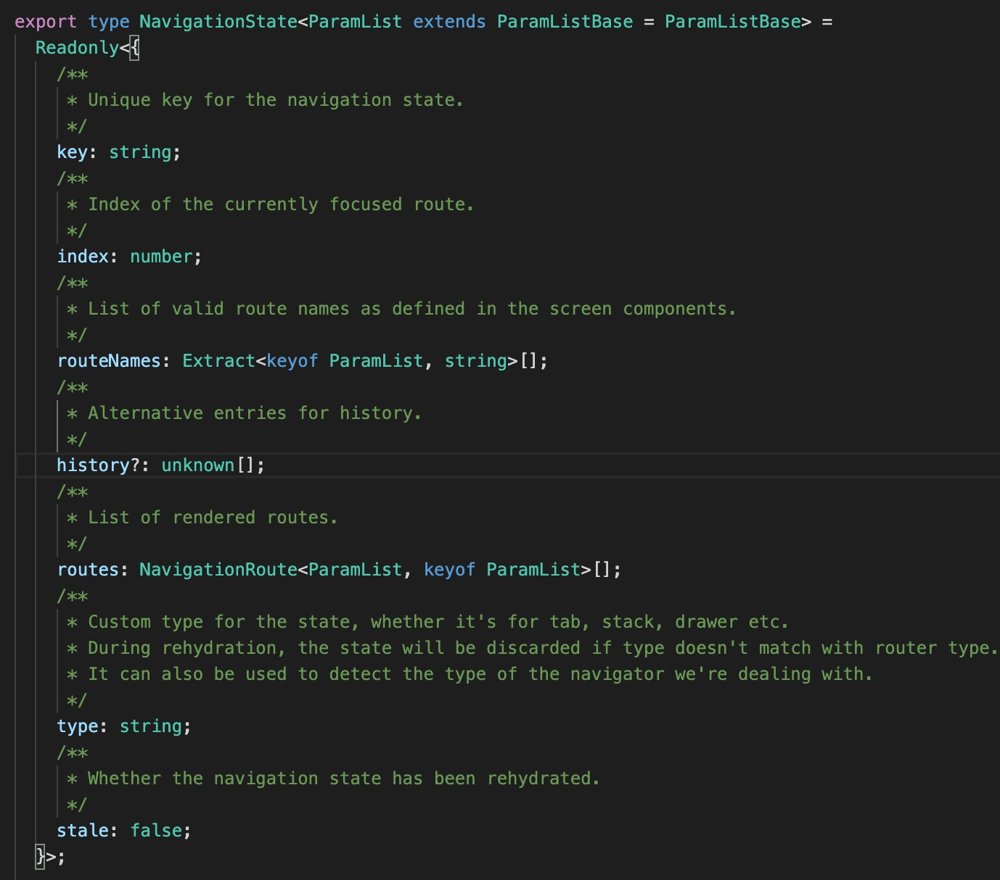

1. NavigationContainer 是整个app 的根组件,管理状态导航

   

2. 状态在BaseNavigationContainer 中

    

+ key: 识别导航器的唯一键

+ index: 数组中聚焦路由对象的索引routes

+ routeNames:导航器中定义的屏幕名称。这是一个包含每个屏幕的字符串的唯一数组

+ history: 历史记录，已访问项目列表。这是一个可选属性，并非在所有导航器中都存在。例如，它仅存在于核心的选项卡和抽屉导航器中。数组中项目的形状history可能因导航器而异。该数组中应该至少存在一项

+ routes: 在导航器中呈现的路线对象（屏幕）列表。它还代表堆栈导航器中的历史记录。该数组中应该至少存在一项

+ stale:除非该stale属性明确设置为true，否则假定导航状态是陈旧的false

   ```js
        const state = {
            type: 'stack',
            key: 'stack-1',
            routeNames: ['Home', 'Profile', 'Settings'],
            routes: [
              { key: 'home-1', name: 'Home', params: { sortBy: 'latest'         } },
              { key: 'settings-1', name: 'Settings' },
            ],
            index: 1,
            stale: false,
        };
   ```

   