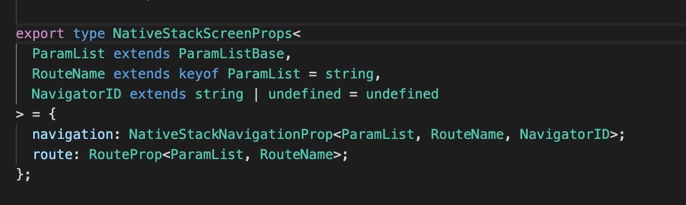
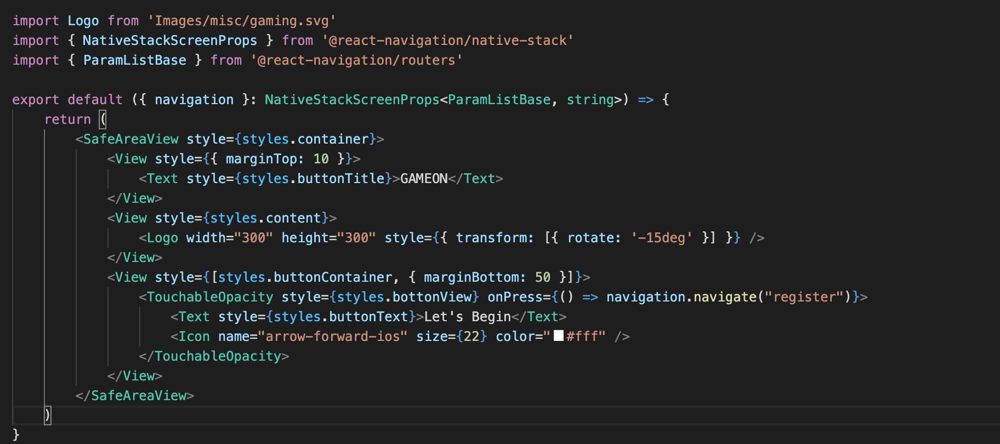
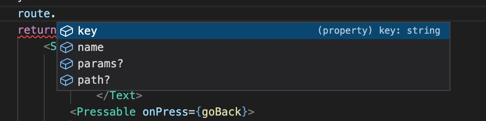
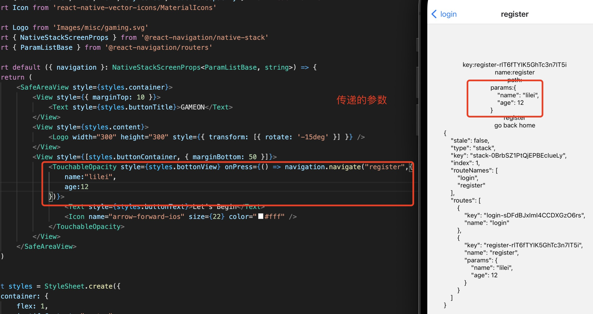

0. stack 类型的页面组件属性有NativeStackScreenProps 提供，react-navigation 会为页面组件注入navigation 和 route props 。

   

+ navigation: 与跳转链接相关

+ route: 路由相关，比如参数等

> 不同类型的导航，Props 类型不一致，但是里面的内容大体一致

  + @react-navigation/native-stack: NativeStackScreenProps

  + @react-navigation/drawer: DrawerScreenProps

  + @react-navigation/bottom-tabs: BottomTabScreenProps

> NativeStackScreenProps 泛型对象的意义

+ 参数列表对象是为导航器定义的

+ RouteName:当前屏幕所属的路由名称。

+ NavigatorID: 导航器的 ID

1. 作为路由指向的页面都会自动在props 中带有一个navigation的属性

   应用中的每个screen组件都自动提供了navigationprop。该道具包含各种方便的功能，可以调度导航操作

    

2. navigation 属性

+ navigate: 跳转另一个链接

        navigation.navigate("register")
    
    > navigate 跳转链接对应的路由定义中的name 

    

    > 传递参数

        navigation.navigate("register",{
            // 参数
            key:value
        })

+ dispatch:

+ reset:重置

+ goBack(): 返回历史导航中是一个

+ getState(): 获取路由导航状态

  

+ getId()

+ replace: 替换路由

+ push()

+ pop

+ popToTop

+ setOptions: 设置Screen 的options ,比如title 等

3. route 属性

  

  

+ key: 当前路由的唯一key

+ name: 路由的名称

+ path: 路径

+ params: 传递的路由参数

  