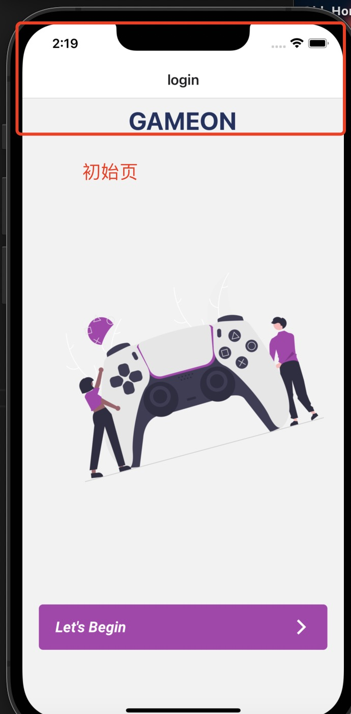
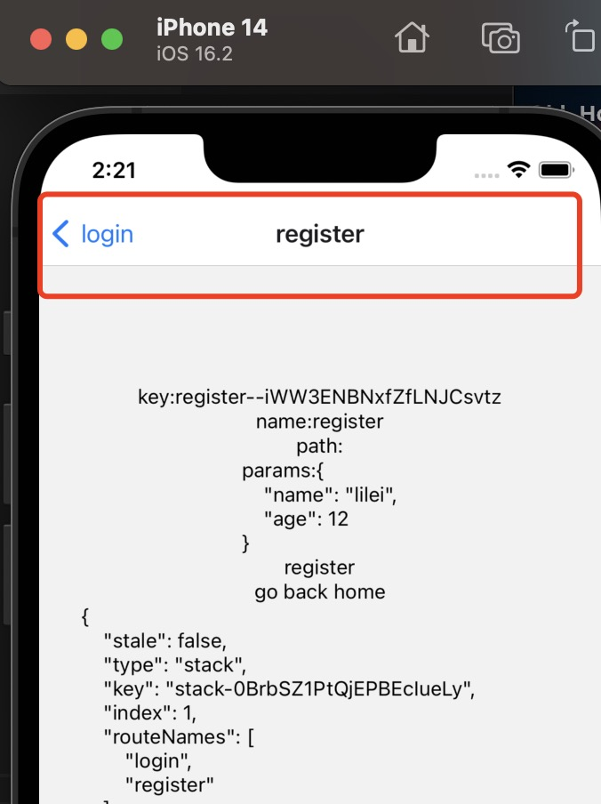
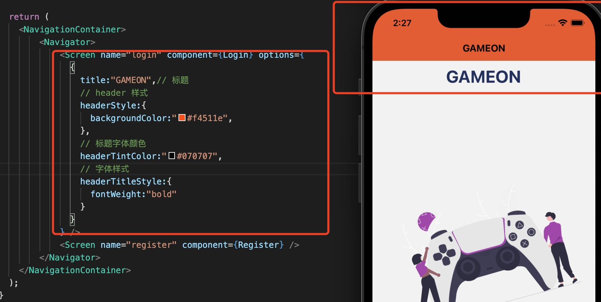
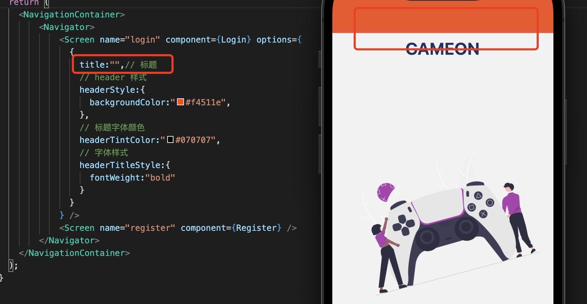
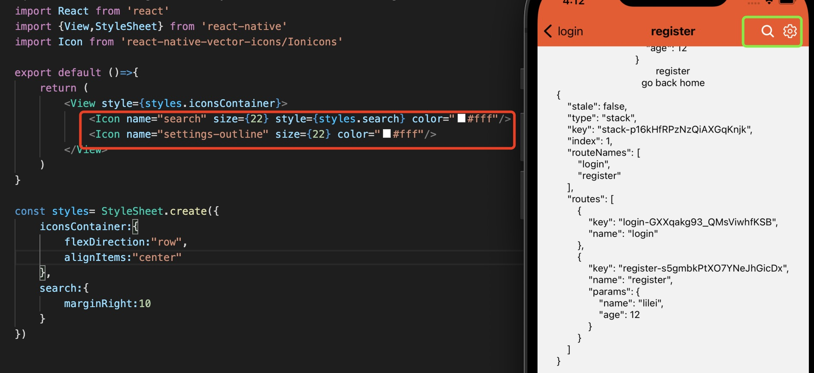
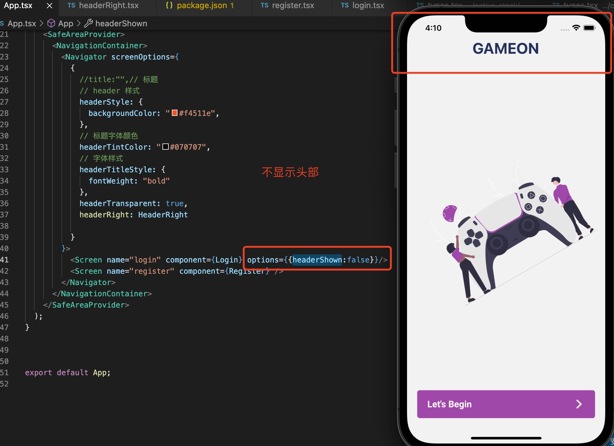
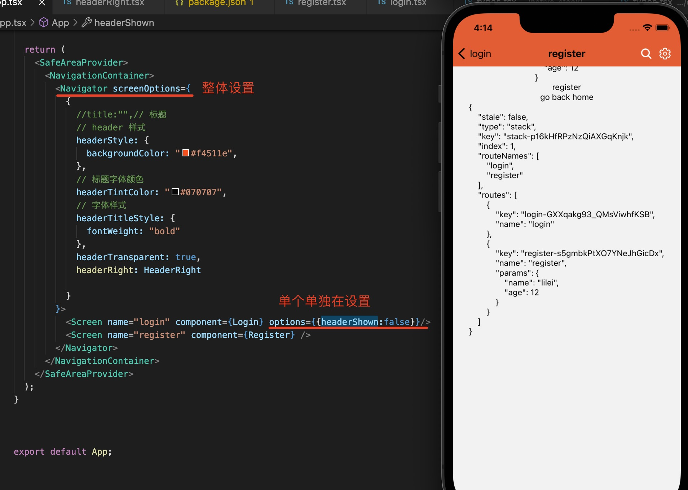

1. Stack 路由设置了默认的标题栏

+ 起始页

   

+ 非起始页

  

2. 在Screen 组件中options 中设置组件

    

+ title: 标题，要显示的文字，默认为路由的name 属性值

    

+ headerStyle: header 整体样式

+ headerTintColor: 后退按钮和标题都使用此属性作为它们的颜色

+ headerTitleStyle: 如果我们想为标题自定义fontFamily,fontWeight和其他样式属性，我们可以使用它来完成

+ headerTitle: 自定义标题组件

+ headerRight: 自定义设置右边组件

  

+ headerLeft: 自定义设置左边组件

+ headerShown: 是否显示导航栏

  

3. header 样式用于整个stack

   在Navigator 组件的screenOptions 中属性设置，这样在整个Navigator 下定义的路由都会应用相同的样式

   

 

   