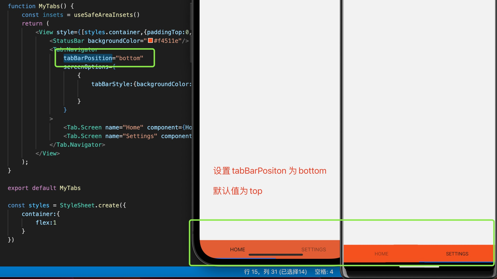
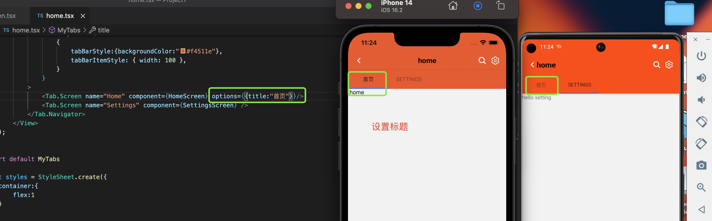
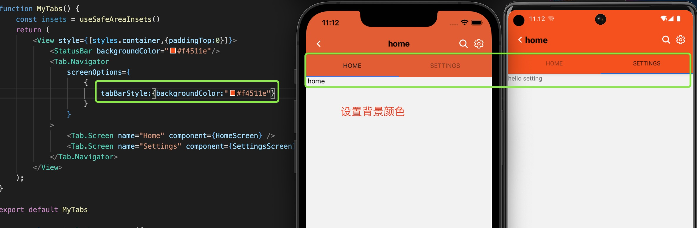
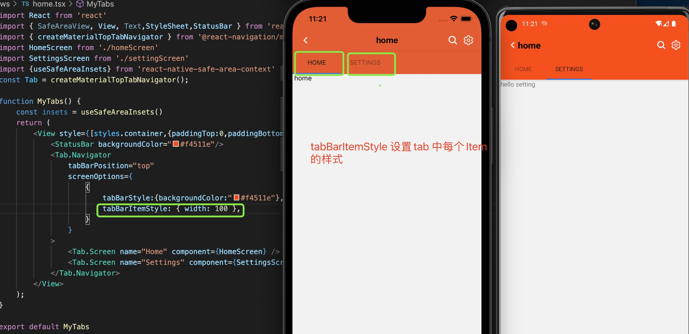
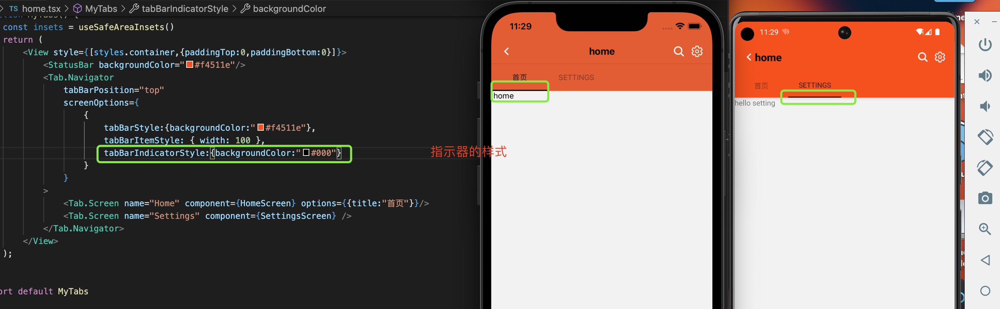
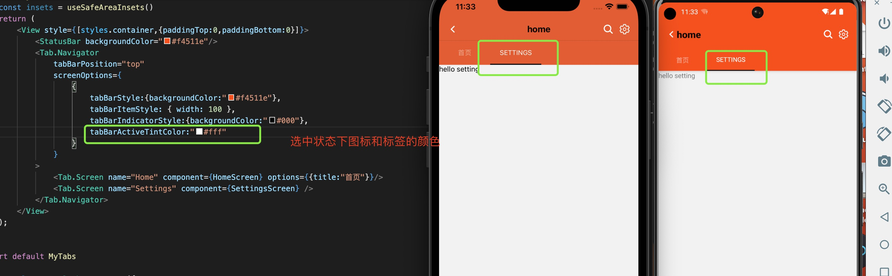
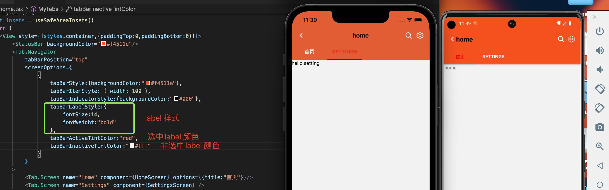

1. @react-navigation/material-top-tabs

   包裹在react-native-tab-view中

   安装：

        npm install @react-navigation/material-top-tabs react-native-tab-view

        或者
        yarn add @react-navigation/material-top-tabs react-native-tab-view

        然后，您需要安装react-native-pager-view导航器所需的。

        npm install react-native-pager-view

        或者

        yarn add react-native-pager-view

    在ios 中安装pod

        cd ios && pod install

        或者

        npx pod-install ios

2. 属性

+ id: 导航器的可选唯一 ID。这可以用于navigation.getParent在子导航器中引用此导航器。

+ initialRouteName: 首次加载要初始化的路由

+ tabBarPosition: 是在顶部还是底部，top,bottom, 默认为top

   

+ tabBar: 自定义组件

+ screenOptions：页面设置选项

   + title: 设置标题

     

   + tabBarStyle：设置tabBar 样式

      

   + tabBarItemStyle: 设置每个tab Item 的样式

     
    
    + tabBarIndicatorStyle：选项卡栏指示器的样式对象

      
    
    + tabBarActiveTintColor：选中的图标和标签的颜色
    
        
    
    + tabBarInactiveTintColor：非选中的图标和标签的颜色

    + tabBarLabelStyle: 

      

