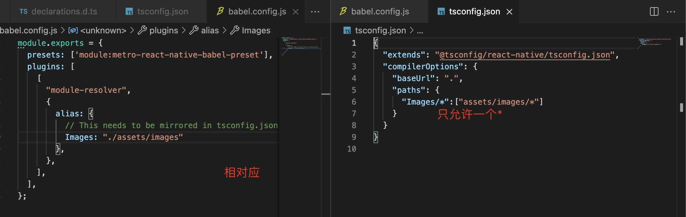
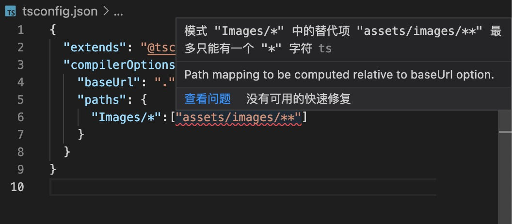

1. 设置别名代替丑陋的相对路径

    在根路径中设置tsconfig.json 中设置

    + 设置baseUrl

            {
                "compilerOptions":{
                    "baseUrl":".", // 设置根路径
                }
            }
    
    + 路径别名在paths 对象中

            {
                "compilerOptions":{
                    "baseUrl":".",
                    "paths":{
                        // Components 是一个文件夹，值必须array 类型
                        "components/*":["src/components/*]，
                        // 指向单个文件
                        "buttons":["src/components/buttons/index"]
                    }
                }
            }

            import { CircleButton } from "components/buttons"
            import { CircleButton } from "buttons"
    
    + 在babel.config.js 中设置babel

        + 添加babel-plugin-module-resolver 

                yarn add --dev babel-plugin-module-resolver
        
        + 配置module-resolver

          
        

        >***注意：tsconfig.json 中路径只允许一个\****

        