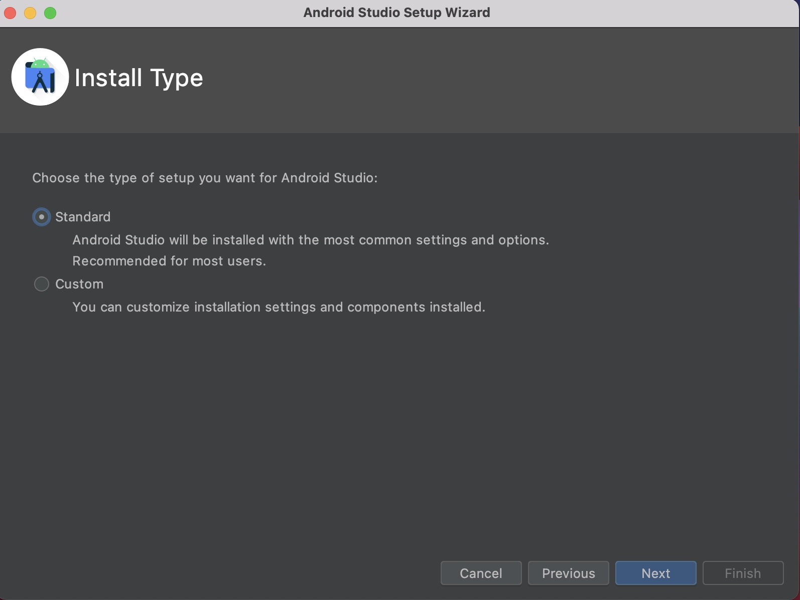

1. 下载android studio 开发工具

    下载网址：https://developer.android.com/studio

    > 如果长时间无法下载，拷贝下载链接把https 改成http，http://redirector.gvt1.com/edgedl/android/studio/install/2022.1.1.20/android-studio-2022.1.1.20-mac_arm.dmg

2. 安装android studio

   参照链接：https://developer.android.com/codelabs/basic-android-kotlin-compose-install-android-studio?continue=https%3A%2F%2Fdeveloper.android.com%2Fcourses%2Fpathways%2Fandroid-basics-compose-unit-1-pathway-2%23codelab-https%3A%2F%2Fdeveloper.android.com%2Fcodelabs%2Fbasic-android-kotlin-compose-install-android-studio#4

    

    

    

    

    

    

    

    

3. 安装android sdk

    Android Studio 默认安装最新的 Android SDK,但是使用react native 需要android 12(S) sdk

    + 在more Actions 中选择sdk manager

      

    + 安装12(S) SDK

      

      点击右下角 show package details 展开sdk 详情

      + 选择 android sdk Platform 31

      + 选择 Inter x86 Atom_64 system image

      + 选择 Google APIs Inter x86 Atom_64 System Image
    
    + 安装SDK Tools

        

      点击右下角 show package details 展开sdk 详情

      在Android SDK Build-Tools 34-rc1 选中31.0.0 

    + 确认安装

        

    + 接受声明

        
    
    + 将android 加入环境变量

        使用的是zsh ，所以在~/.zshrc 中加入以下代码

            export ANDROID_HOME=$HOME/Library/Android/sdk

            export PATH=$PATH:$ANDROID_HOME/emulator

            export PATH=$PATH:$ANDROID_HOME/platform-tools
        
        刷新source ~/.zshrc

        验证：

            echo $ANDROID_HOME

            或者

            echo $PATH
      

4. 安装node 和 watchman 

  + 安装node 

        brew install node

  + 安装watchman 

    Watchman是 Facebook 的一个工具，用于监视文件系统中的更改

        brew install watchman

5. 注意：最后按照react native 官网安装，不然会发生不必要的问题，比如 jdk ，react native 邀请使用java11, 使用高版本的可能导致gradle 版本对应不上，在编译打包时发生错误

    

