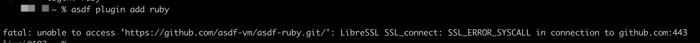

1. 安装node 和 watchman 

  + 安装node 

        brew install node

  + 安装watchman 

    Watchman是 Facebook 的一个工具，用于监视文件系统中的更改

        brew install watchman

2. 安装ruby

   React Native 在一些与 iOS 依赖管理相关的脚本中使用了ruby

   React Native 使用一个.ruby-version文件来确保您的 Ruby 版本与所需的一致

   查看react Native 中使用的ruby 版本号：https://github.com/facebook/react-native/blob/main/template/_ruby-version

   使用ruby --version 查看是否与react native 中一致，不一致要安装一致的版本

   在安装过程中，mac m1 芯片出了很多问题，

        brew doctor

    安装asdf ruby 版本控制

        brew install asdf 

    将 asdf 添加到 .zshrc 文件

        echo -e "\n. $(brew --prefix asdf)/libexec/asdf.sh" >> ~/.zshrc
    关闭终端重新代开，首先，为 Ruby 安装 asdf 插件：

        asdf plugin add ruby

    > 遇到ssl 443 问题

    

    ***解决办法：设置git http.sslVerify 为false***

        git config --global http.sslVerify false
    
    查看所有可用的 Ruby 版本：

        asdf list all ruby
    
    如果您没有看到最新版本的 Ruby，请更新 Ruby 的 asdf 插件并重试：

        asdf plugin-update ruby

         asdf list all ruby
    
    安装ruby 指定版本

        asdf install ruby 2.7.6
    
    指定使用asdf ruby 版本

        asdf local ruby 2.7.6 
    
    关闭终端，重新打开，查看ruby 版本

        ruby -v
    
    参考链接：https://mac.install.guide/ruby/6.html

3. 安装xcode ,在app store 中安装xcode

4. 安装CocoaPods，

    CocoaPods 管理 Xcode 项目的库依赖项。类似于node.js 中的npm

    项目的依赖项在称为 Podfile 的单个文本文件中指定。CocoaPods 将解决库之间的依赖关系，获取生成的源代码，然后在 Xcode 工作区中将它们链接在一起以构建您的项目。

    > CocoaPods 是用 Ruby 构建的，

        sudo gem install cocoapods
    
    