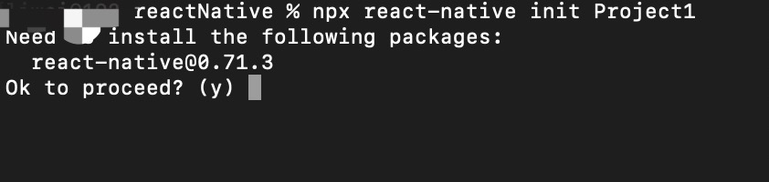
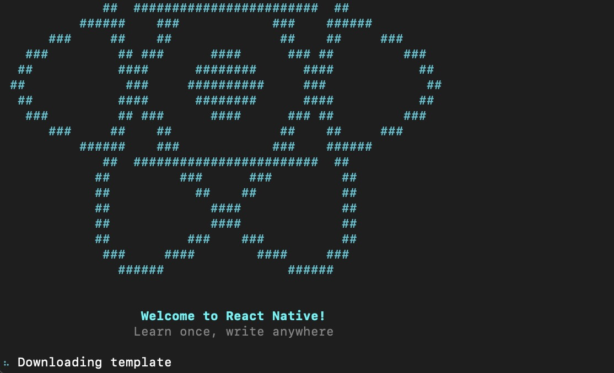

1. 使用react-native 命令创建第一个app 应用

        npx react-native init Project1

        npx react-native init Project1 --verbose
    
    

    

2. 在mac m1 电脑上如果出现install bundles 长时间等待，基本上就是出现问题了，如果环境安装没有问题，可以再编辑器中打开代码

        cd ios //进入ios 文件夹

        直接安装pod install 

        如果有问题可以尝试下面的操作

        bundle install // 安装

        bundle exec pod install  

3. 安装完成以后运行

    首先运行   npx react-native start

    react-native start starts Metro Bundler.

    然后再运行应用程序

    npx react-native run-ios

    npx react-native run-android

