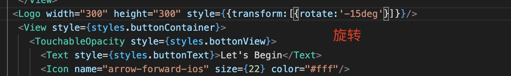

0. 在react native 中所有组件默认使用flexBox 布局，因此没有display:flex 

1. paddingHorizontal: 水平方向左右两边的padding ,类似于同时设置paddingLeft 和 paddingRight 两边的padding

2. paddingVertical: 垂直方向上下两边的padding,类似于同时设置paddingTop 和 paddingBottom 两边的padding

3. marginHorizontal: 水平方向上的左右两边的margin,类似于同时设置marginLeft 和 marginRight 两边的margin

4. marginVertical: 垂直方向上的上下两边的margin,类似于同时设置marginTop 和 marginBottom 两边的padding

5. elevation: 这会为项目添加阴影并影响重叠视图的 z 顺序。仅在 Android 5.0+ 上支持

   > android 上阴影(shadow) 和 zIndex 

6. transform 使用对象形式

   
