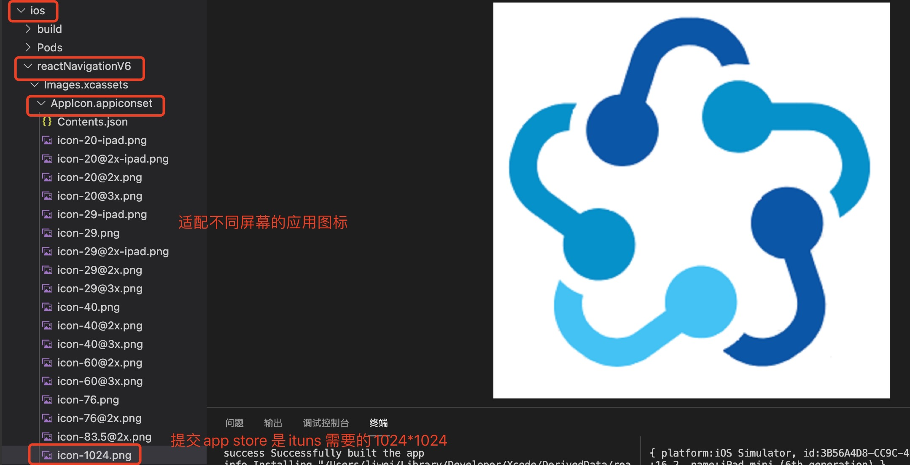
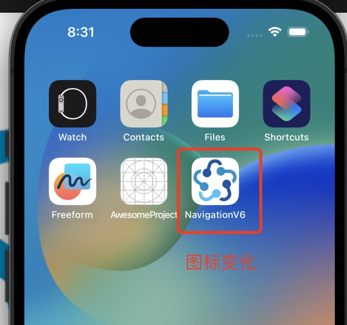
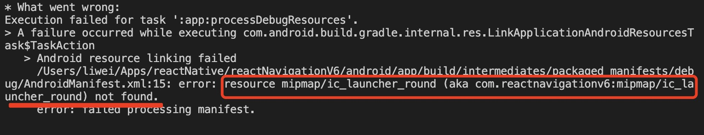
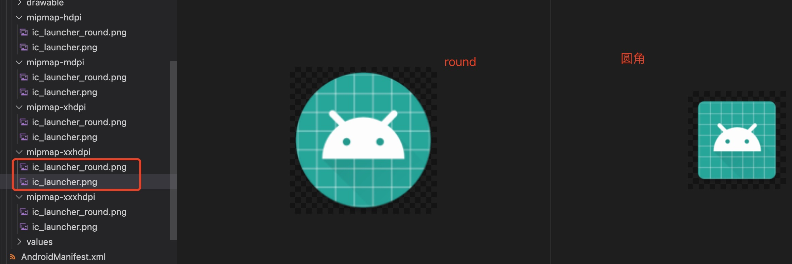
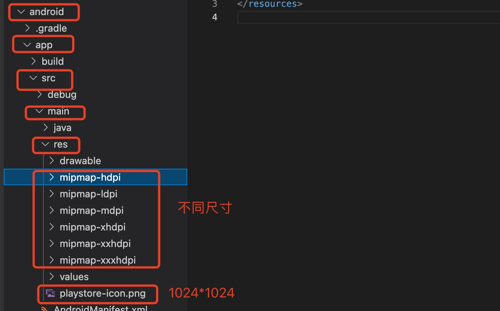
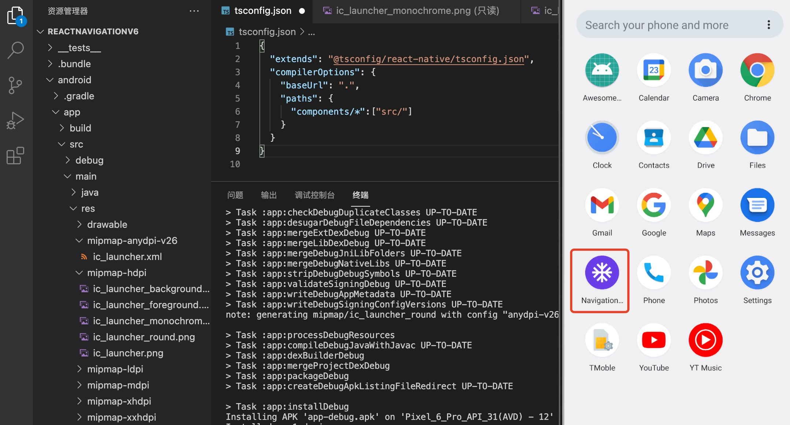

1. 要更改此默认图标，我们需要针对不同设备使用不同大小的自己的应用程序图标

   > 要求图标为1024*1024 的，然后根据1024*1024 的生成适配屏幕的不同图标

2. 更改ios 图标

    使用类似图标工厂(https://icon.wuruihong.com/)这样的网站可以根据1024*1024 图标直接生成对应的图标

   

   重新编译和启动ios

   

3. 更改android 图标

   android 需要round 
   

   

   

   重新编译android 

   
