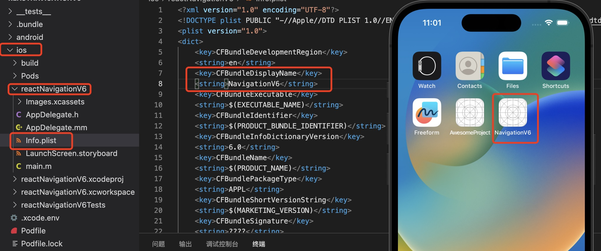
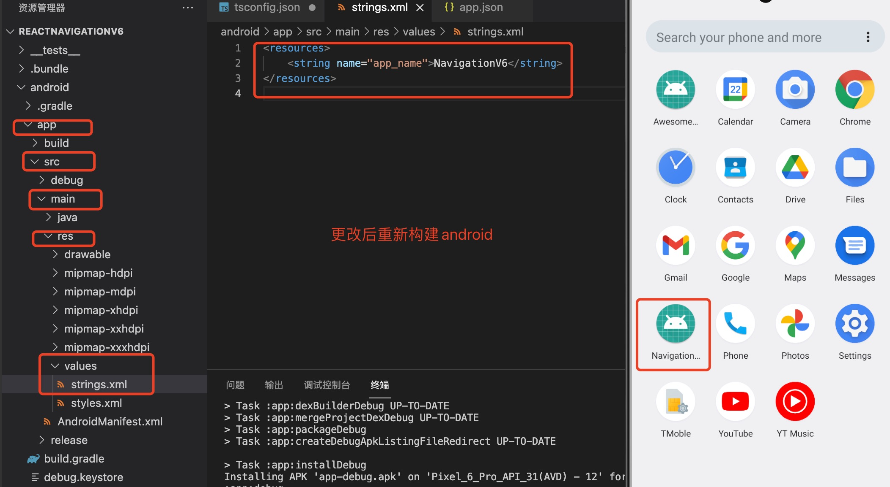

1. 在ios 中，找到info.plist 文件CFBundleDisplayName对应的名称为应用名称

    ```xml
    <key>CFBundleDisplayName</key>
    <string>My New App Name</string>
    ```
   
   

2. android 中在android/app/src/main/res/values/string.xml里面修改应用名称

    