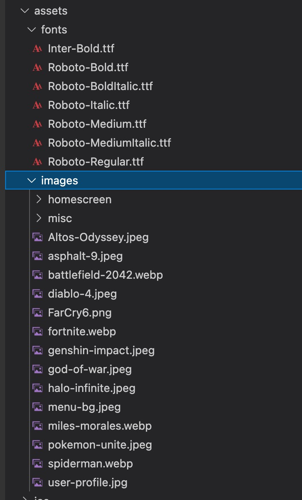
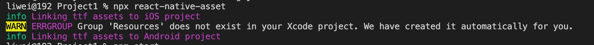
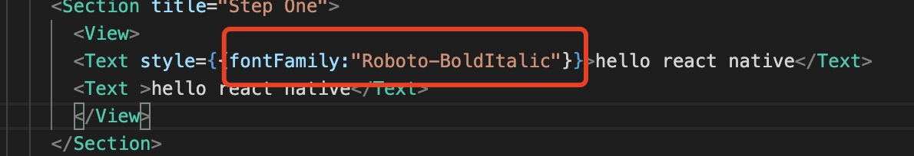

1. 在根目录下创建assets 文件，放置图标和fonts

     

2. 在根目录下创建react-native.config.js

        touch react-native.config.js

3. 在react-native.config.js 中配置字体

    ```javascript
        module.exports={
            assets:["./assets/fonts"]
        }
    ```

4. react-native 0.67 以后删除了link, 使用react-native-asset 

        npx react-native-asset

    如果没有安装，会提示你安装，选择y 即可

    

5. 使用字体样式

    

    