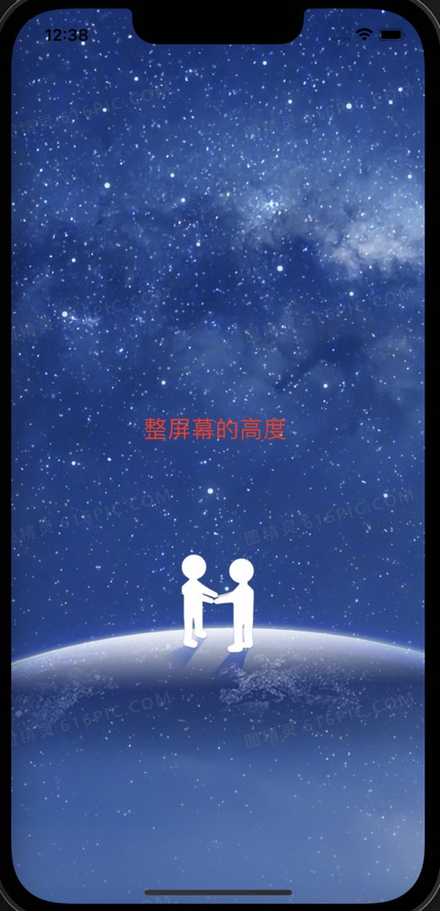
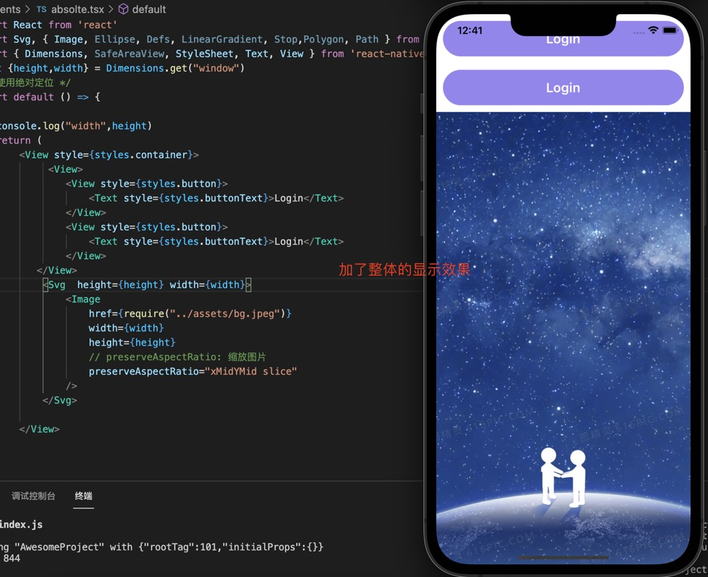
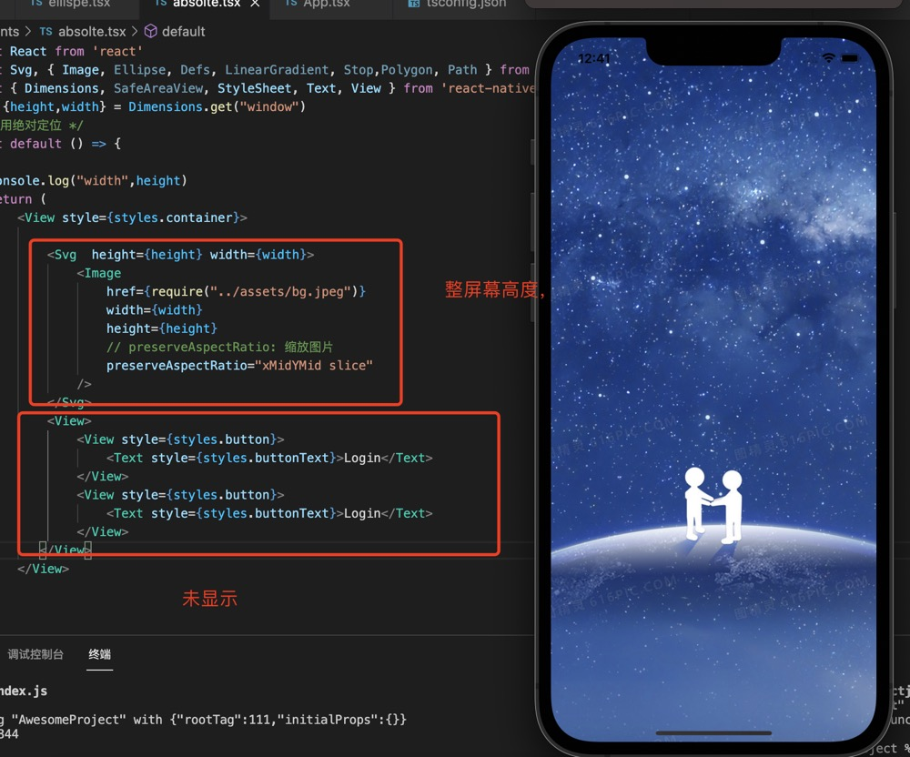
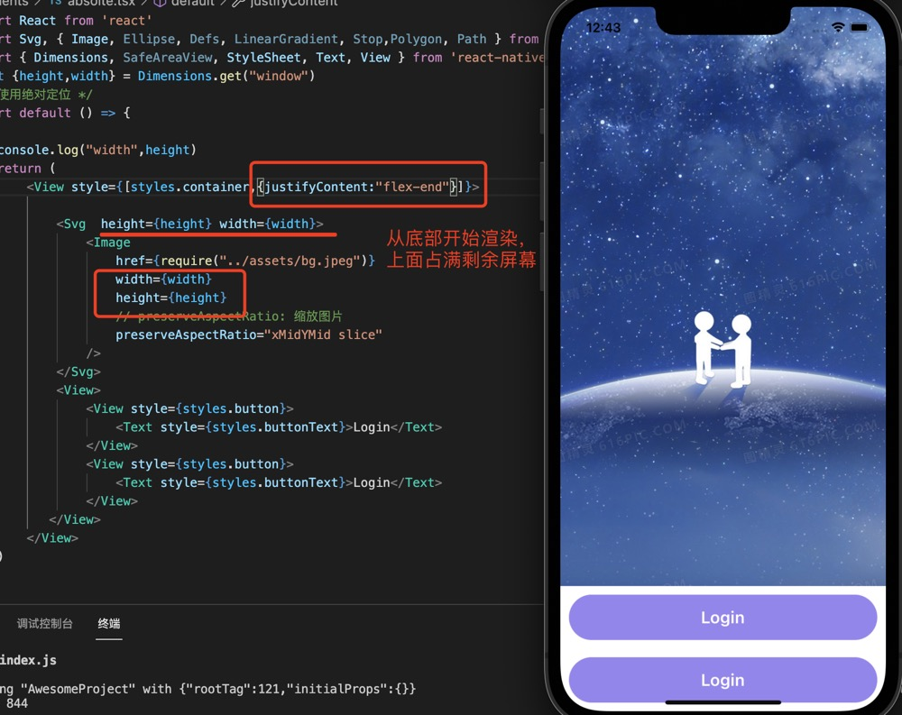

1. 在react native 中设置高度和宽度

   组件的高度和宽度决定了其在屏幕上显示的尺寸。

2. 固定宽度和固定高度

    >***注意：在React Native 中组件的尺寸是无单位的，它们表示与密度无关的像素。***

+ 使用Dimensions Api获取屏幕的高度和宽度

    ```jsx
        import { Dimensions } from 'react-native'
        const {height,width} = Dimensions.get("window")
    ```

3. flex

   flex属性设置组件样式以根据可用空间动态扩展和收缩它。设置 flex: 1 将填充组件的所有可用空间，并在与父组件相同的其他组件之间平均共享。flex 值越高，与其兄弟相比，占据组件的空间比例越高 

   >***组件能够撑满剩余空间的前提是其父容器的尺寸不为零。如果父容器既没有固定的width和height，也没有设定flex，则父容器的尺寸为零。其子组件如果使用了flex，也是无法显示的。***

4. 百分比高度

    如果你想要按比例填充屏幕上某一部分，又不想使用 flex 布局，那么可以在组件的style中使用百分比。与弹性宽高相似，百分比宽高要求父容器有一个明确的尺寸。

5. flex 当子元素的高度大于父元素的高度时，***多出的部分将不会显示***

   整体高度显示效果
   

   flex: justifyContent 布局默认为flex-start, 从上往下渲染
   

   将View 放到下面，因为图片的高度是整屏的高度，View 将不会显示
   

   将justifyContent 设为flex-end
   