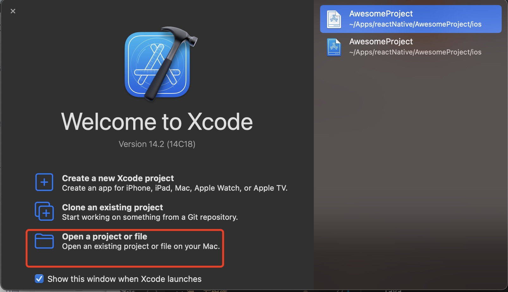
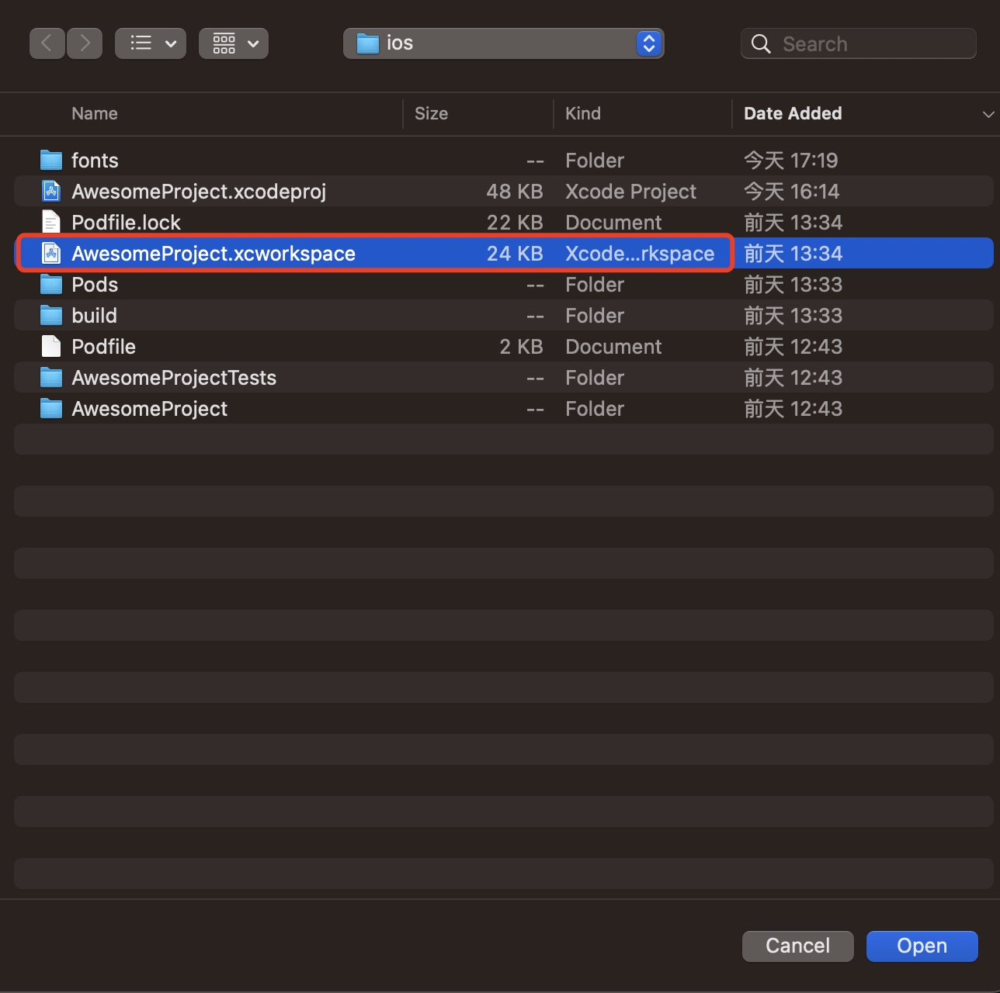
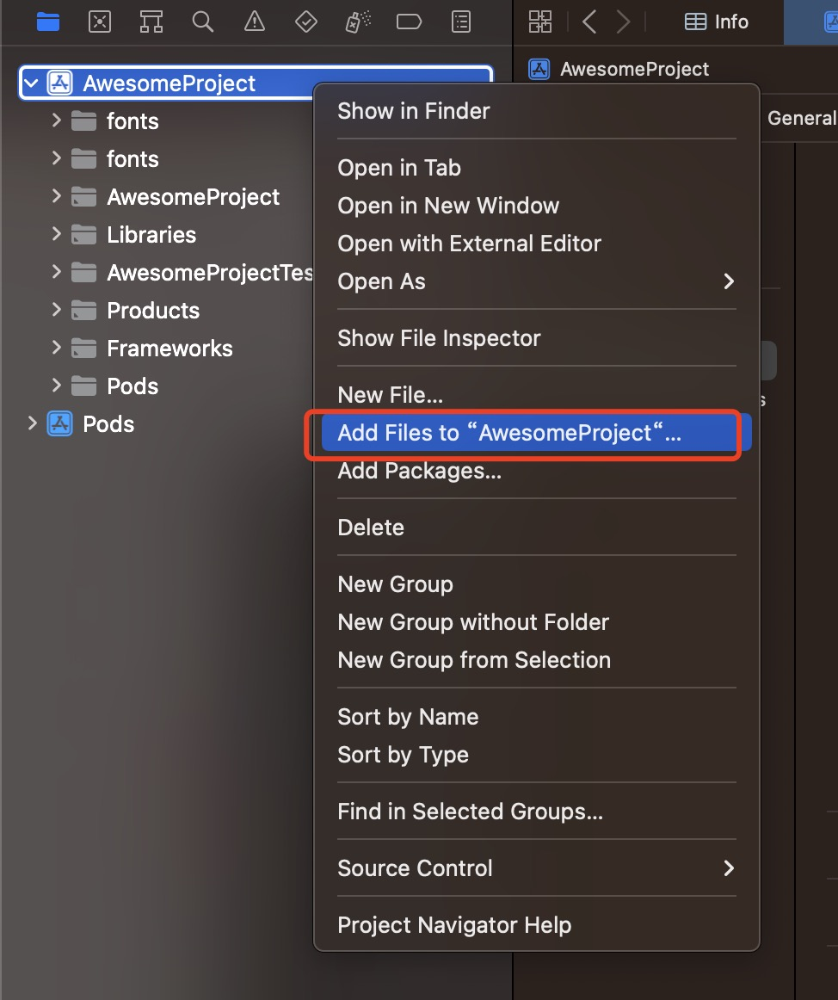
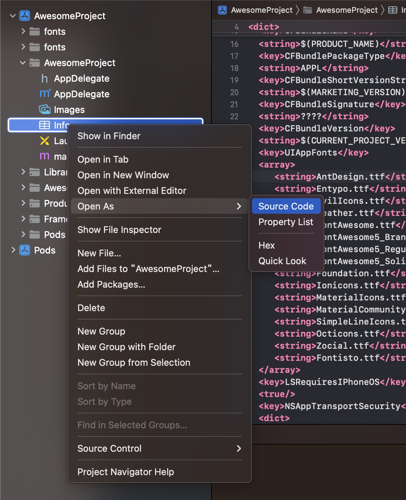
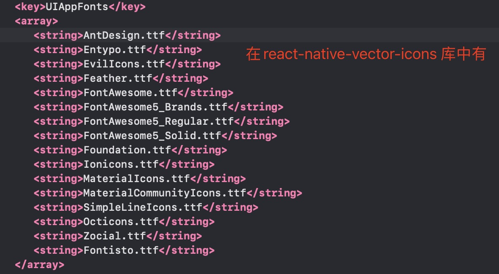

1. react-native-vector-icons: 图标组件

    @expo/vector-icons/Ionicons: 是在react-native-vector-icons基础上包裹的一层，用于expo 模式

2. 使用react-native-vector-icons 配置过程

+ 安装react-native-vector-icons

        npm install react-native-vector-icons --save

        或者

        yarn add react-native-vector-icons -S

        安装typescript 声明

        yarn add @types/react-native-vector-icons -D

+ ios pod 安装

        npx pod-install ios

+ android 配置

   要在 Android 中使用 react-native-vector-icons，我们需要编辑android/app/build.gradle（不是 android/build.gradle）并添加以下内容：

  ```java
     apply from: "../../node_modules/react-native-vector-icons/fonts.gradle"
  ```

     此方法将在构建时从 react-native-vector-icons 模块复制字体

+ ios 配置

  + 现在在 Xcode 中打开项目YourProject -> ios -> YourProject.xcworkspace   

     

     

  + 右键项目，选择Add Files to "YourProject"

     

   + 选择要添加的文件夹

     

   + 在YourProject 下找到Info.plist 

     

   + 添加字体

     

   + 在react-native 项目中，进入ios 目录 pod update

        cd ios && pod update

   + 重启项目

        npx react-native start

        npx react-native run-ios

        或者使用package.json 中定义的script 命令
     