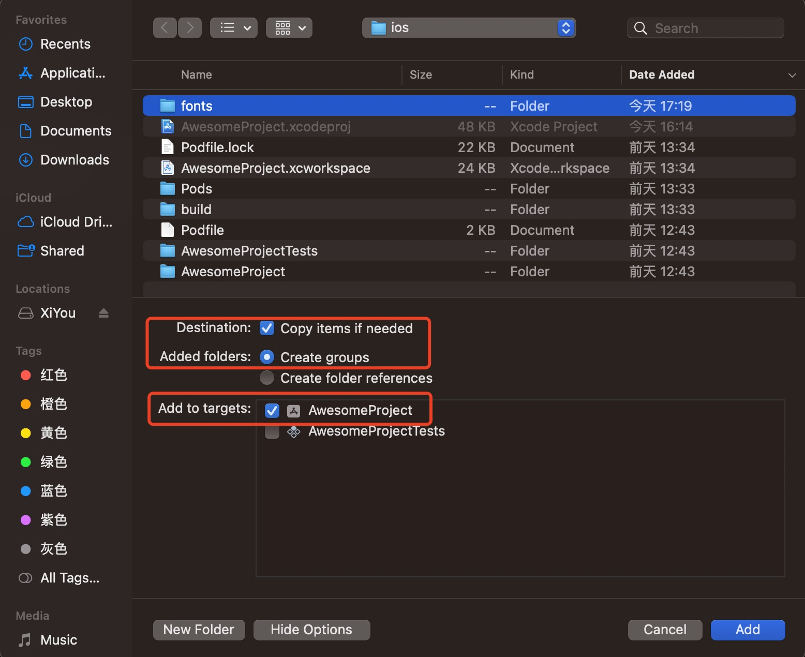

1. react-native-vector-icons: 图标组件

    @expo/vector-icons/Ionicons: 是在react-native-vector-icons基础上包裹的一层，用于expo 模式

2. 使用react-native-vector-icons 配置过程

+ 安装react-native-vector-icons

        npm install react-native-vector-icons --save

        或者

        yarn add react-native-vector-icons -S

        安装typescript 声明

        yarn add @types/react-native-vector-icons -D

+ ios pod 安装

        npx pod-install ios

+ android 配置

   要在 Android 中使用 react-native-vector-icons，我们需要编辑android/app/build.gradle（不是 android/build.gradle）并添加以下内容：

  ```java
     apply from: "../../node_modules/react-native-vector-icons/fonts.gradle"
  ```

     此方法将在构建时从 react-native-vector-icons 模块复制字体

+ ios 配置

  + 现在在 Xcode 中打开项目YourProject -> ios -> YourProject.xcworkspace   

     

     

  + 右键项目，选择Add Files to "YourProject"

     

   + 选择要添加的文件夹

     

   + 在YourProject 下找到Info.plist 

     

   + 添加字体

     
     ```javascript
        <key>UIAppFonts</key>
	      <array>
          <string>AntDesign.ttf</string>
          <string>Entypo.ttf</string>
          <string>EvilIcons.ttf</string>
          <string>Feather.ttf</string>
          <string>FontAwesome.ttf</string>
          <string>FontAwesome5_Brands.ttf</string>
          <string>FontAwesome5_Regular.ttf</string>
          <string>FontAwesome5_Solid.ttf</string>
          <string>Foundation.ttf</string>
          <string>Ionicons.ttf</string>
          <string>MaterialIcons.ttf</string>
          <string>MaterialCommunityIcons.ttf</string>
          <string>SimpleLineIcons.ttf</string>
          <string>Octicons.ttf</string>
          <string>Zocial.ttf</string>
          <string>Fontisto.ttf</string>
	      </array>
     ```

   + 在react-native 项目中，进入ios 目录 pod update

        cd ios && pod update

   + 重启项目

        npx react-native start

        npx react-native run-ios

        或者使用package.json 中定义的script 命令
     

    >如果出现Multiple commands produce '：Copy Pods Resources 错误

    

    解决办法：

    >删除重复的字体文件Copy Bundle Resources对我有用。
    问题似乎是由 React Native 0.60 中的新自动链接功能引起的——inuse_native_modules!中的行ios/Podfile意味着当你这样做时pod install，在中找到的任何 podnode_modules都会自动链接。这意味着[CP] Copy Pods Resources在您执行此操作时会添加指向所有字体文件的链接pod install。

    >如果您之前react-native-vector-icons通过将字体文件添加到 手动安装Copy Bundle Resources，则会收到“多个命令产生...”致命构建错误。

    >所以要解决这个问题，只需从中删除字体文件Copy Bundle Resources，这样它们就只在[CP] Copy Pods Resources

    
    
    删除上面的字体