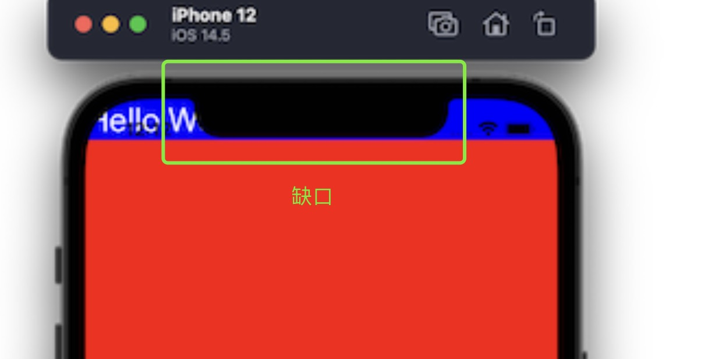
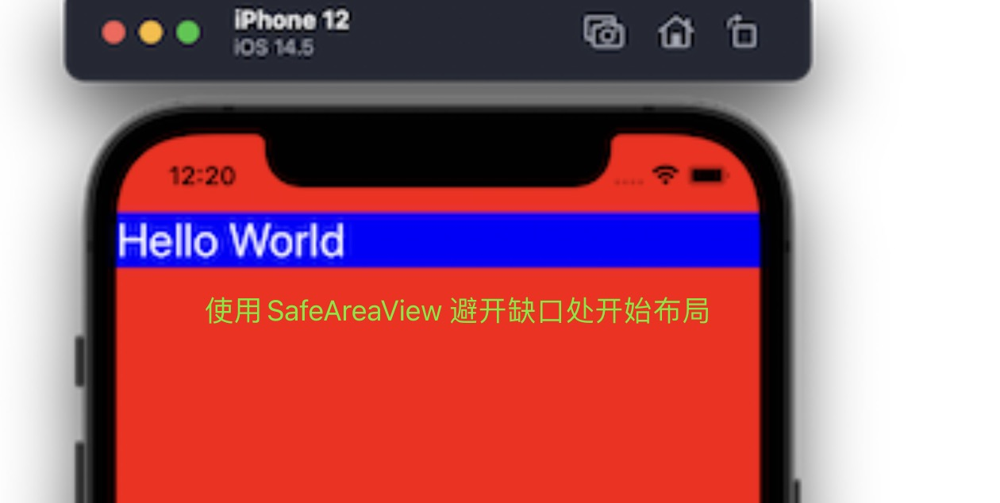
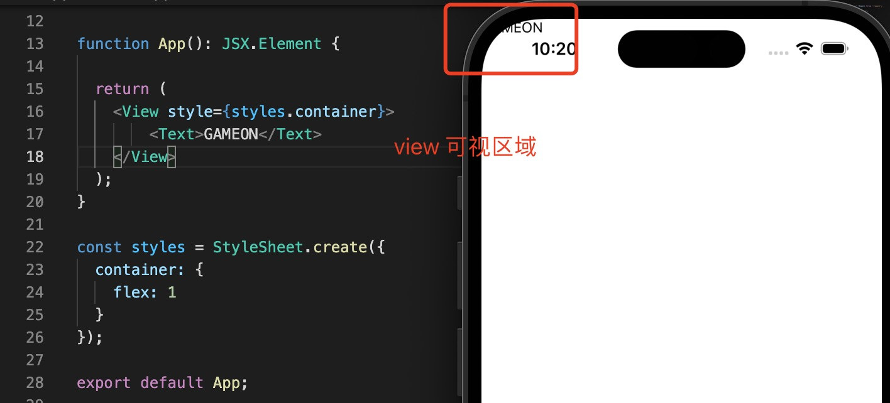
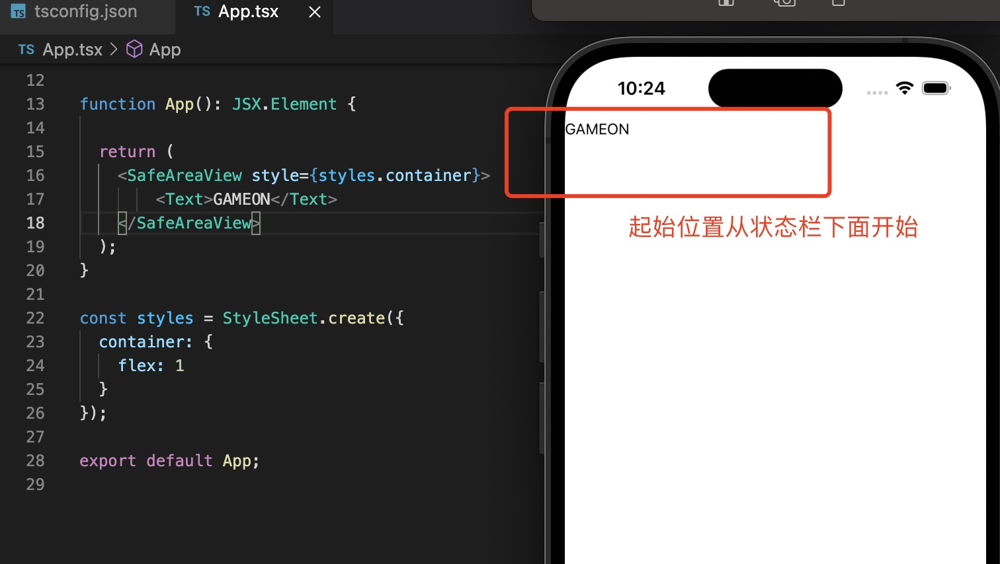

0. 1. 现在大多数设备的屏幕顶部都有一个凹口。因此，当您使用 React Native 构建移动应用程序时，您需要确保应用程序屏幕的内容在不同类型的设备上正确呈现

   

   为了避免缺口影响，safeAreaView 避开了缺口

   

   > 虽然SafeAreaView 可以避免缺口，但是SafeAreaView 是ios 独有的组件，android 不起作用

1. view 可视

   

2. SafeAreaView: 安全区域，避开凹凸，状态栏等

   

   >***注意：SafeAreaView 只用于ios***

3. react-native-safe-area-context： 第三方组件，兼容ios 和 android

    https://github.com/th3rdwave/react-native-safe-area-context

