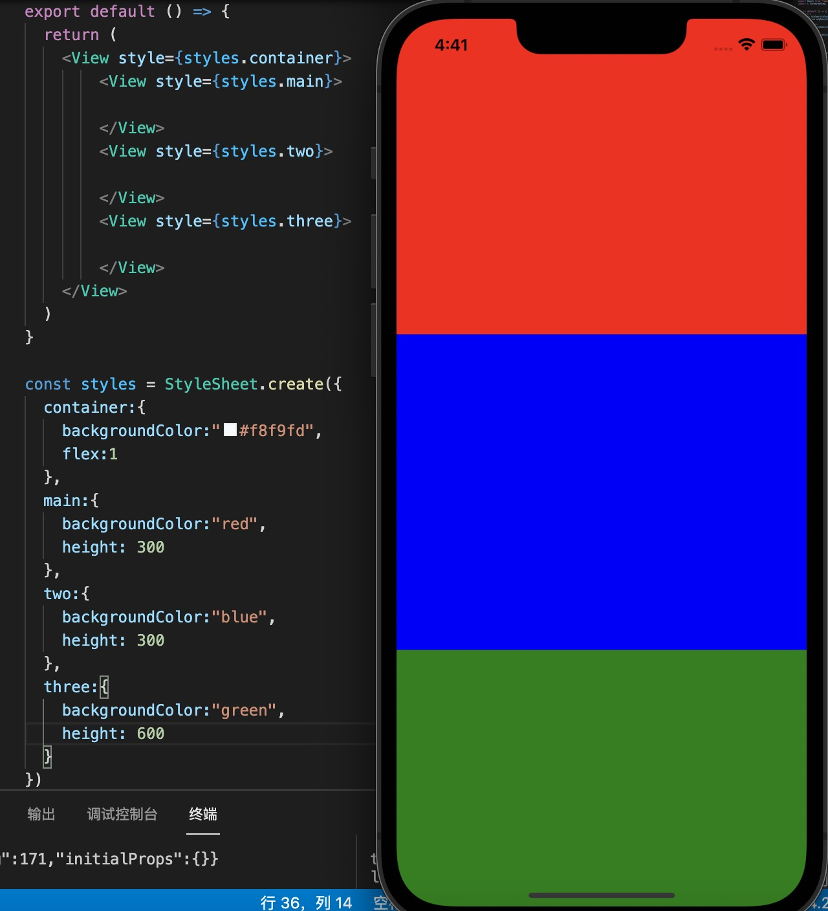
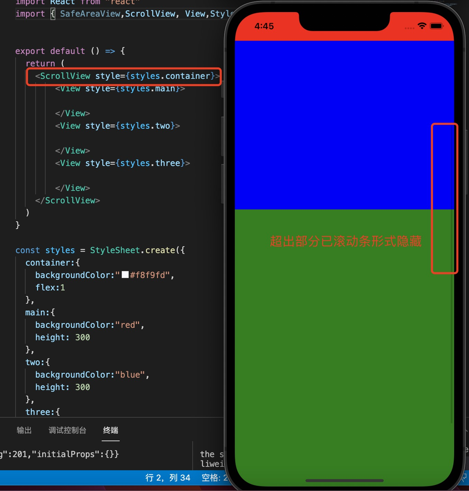

1. view : 类似于html 中的div 标签，布局用的, 但是超出屏幕范围并不会出现滚动条，后面的内容会被隐藏

    

    绿色的部分为600，但是后面的不能显示
    

2. scrollView : 在app 中默认视图占满屏幕并不会滚动，因此要使用滚动必须使用scrollView 包裹，scrollView 包括垂直滚动和水平滚动

    

    > ScrollView一次渲染它的所有 React 子组件，但这有性能上的缺点。

    > ***注意：ScrollView 必须有固定的高度***

    + horizontal：是否水平滚动，默认为false， 

      ScrollView 可以再垂直方向上和水平方向上滚动，默认是垂直方向

    + onScroll: 事件

    + onScrollBeginDrag

    + onScrollEndDrag

    + refreshControl：一个 RefreshControl 组件，用于为 ScrollView 提供下拉刷新功能

        >仅适用于垂直滚动视图

    + scrollTo()： 滚动到指定位置

            scrollTo(
                options?: {x?: number, y?: number, animated?:   boolean} | number,
                deprecatedX?: number,
                deprecatedAnimated?: boolean,
            );

            scrollTo({x: 0, y: 0, animated: true})

    + scrollToEnd()： 滚动到视图底部

            scrollToEnd(options?: {animated?: boolean});

        用于scrollToEnd({animated: true})平滑的动画滚动，scrollToEnd({animated: false})用于立即滚动。如果未传递任何选项，则animated默认为true.