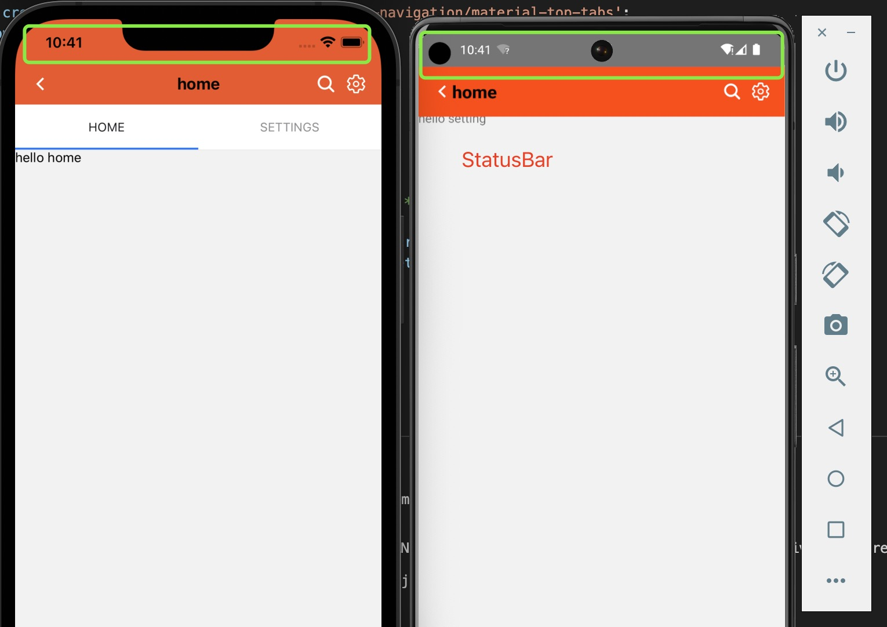
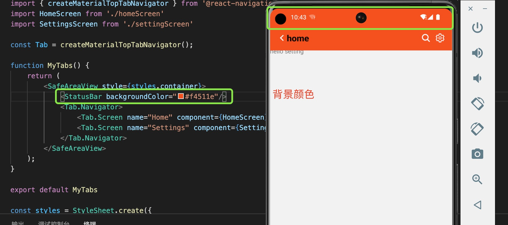

1. StatusBar 用于控制应用程序状态栏的组件。状态栏是一个区域，通常位于屏幕顶部，显示当前时间、Wi-Fi 和蜂窝网络信息、电池电量和/或其他状态图标。

   

2. backgroundColor： 设置背景颜色，只对android 应用

   

3. barStyle： 设置状态栏文本的颜色。

4. hidden: 是否隐藏状态栏

5. translucent：是否设置状态栏半透明，安卓