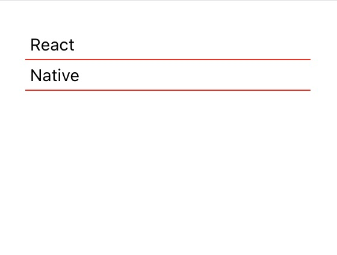
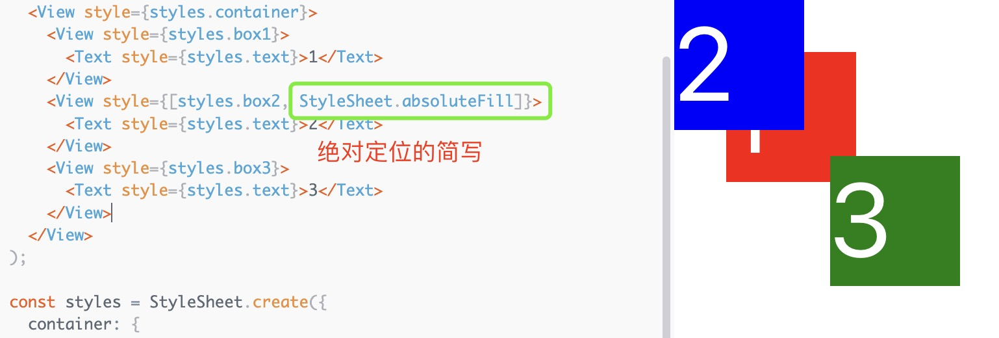
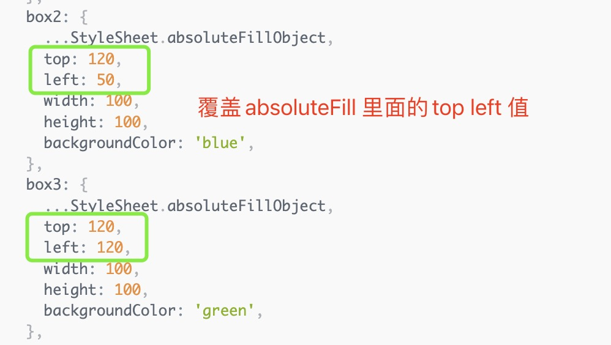

1. react native 使用style 定义样式，样式必须遵循JavaScript规范

   样式名称和值通常与 CSS 在 Web 上的工作方式相匹配，***除了名称使用驼峰式大小写，例如而backgroundColor不是background-color.***
  
2. StyleSheet.create 简化代码中的样式定义

    StyleSheet.create 函数接受一个对象({})作为参数，对象中的key 可以看出样式的名称，例如

        const styles = StyleSheet.create({
            sectionContainer: {
              marginTop: 32,
              paddingHorizontal: 24,
            },
            sectionTitle: {
              fontSize: 24,
              fontWeight: '600',
            },
            sectionDescription: {
              marginTop: 8,
              fontSize: 18,
              fontWeight: '400',
            },
            highlight: {
              fontWeight: '700',
            },
        });

      使用样式：

          <View style={styles.sectionContainer}>
              <Text
                style={[
                  styles.sectionTitle, // 使用样式
                  {
                    color: isDarkMode ? Colors.white : Colors.        black,
                  },
                ]}>
                {title}
              </Text>
          </View>

    >使用多个样式，使用数组包裹[]

        <View
        style={[
          styles.box,
          {
            top: 25,
            left: 25,
            position,
            backgroundColor: 'powderblue',
          },
        ]}
      />
  
3. styles 中使用表达式

        <Text style={[{fontSize:24,color:COLORS.dark},
            currentIndex === index && {color:COLORS.primary}
        ]}>

4. StyleSheet.hairlineWidth: 这被定义为平台上细线的宽度。它可以用作两个元素之间的边界或分隔线的粗细。

    

5. absoluteFill:绝对定位absolute

    一种非常常见的模式是创建具有绝对位置和零定位 ( position: 'absolute', left: 0, right: 0, top: 0, bottom: 0) 的叠加层，因此absoluteFill可用于方便并减少这些重复样式的重复

    
  
6. absoluteFillObject：有时您可能想要absoluteFill但需要进行一些调整 -absoluteFillObject

    

